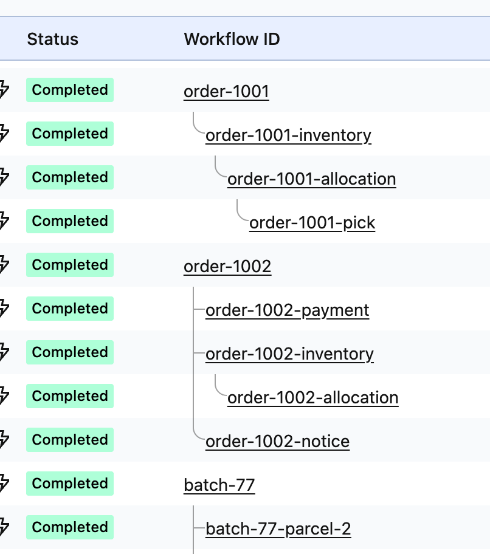
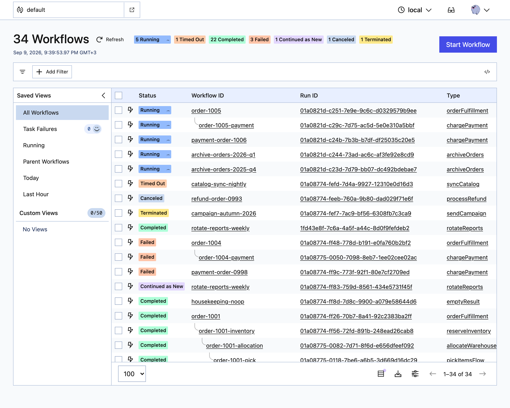

# 01 — family tree

The smallest thing in this repository that is still worth installing: the Temporal
workflow list, with parent/child families grouped and drawn.

**It asks for no permissions at all.** Its `manifest.json` has no `permissions` key, no
`host_permissions` key, and no service worker. There is no `chrome.*` call anywhere in
`src/` — `grep -rnE 'chrome\.' src/` finds only the comment saying so.

Every connector kind on one screen — an elbow for an only child, a branch and a
continuing line for siblings, and a chain deep enough that a line has to run past a
nested block:



There is nothing to configure, no popup, and no stored state. It draws the tree or it
does not; if you want it off, disable the extension.

## Run it

```bash
npm install          # from the repository root, once
npm run build        # from this directory
```

The Node range `npm install` needs is in [the root README](../README.md#start-with-01).

`chrome://extensions` → **Developer mode** → **Load unpacked** → select
`01-family-tree/dist/`.

Then open a workflow list — Temporal Cloud, or a local `temporal server start-dev` —
and reload the tab. There has to be something to group: the tree only shows itself on a
namespace where some workflows start child workflows, so a namespace of unrelated
singletons looks exactly like an extension that failed to load.

What loading it changes is the order of the rows and the connectors beside them — no
column, no button, no popup:



## How it works, in one paragraph

The page already fetches the workflow list. A `document_start` content script in the
page's **own** world (`"world": "MAIN"`) wraps `window.fetch`, clones any response from
`/api/v1/namespaces/{ns}/workflows`, and `postMessage`s the rows to the extension's
world, which folds them into a tree and rewrites the table. No request is ever issued by
the extension, which is why it needs no permission: it only ever sees data the page was
already allowed to receive.

The non-obvious parts — the `window.fetch` getter lock and how to hand a later
assignment back without creating a cycle, `<tr>` recycling, the self-feeding
`MutationObserver`, an older list response arriving after a newer one, and why
`z-index` must be exactly `0` — are in
[`../docs/how-it-works.md`](../docs/how-it-works.md) and in the comments at the top of
each file.

## Security card

Every project in this repository carries one of these, in a fixed shape so the projects
can be compared line by line.

| | 01 — family tree |
|---|---|
| **Permissions requested** | none. `public/manifest.json` has no `permissions` key |
| **Host permissions** | none |
| **Runs on** | `https://cloud.temporal.io/*`, `http://localhost/*`, `http://127.0.0.1/*` |
| **Service worker** | none |
| **Data it reads** | the workflow-list response the page had already fetched, and the table's own `href`s |
| **Data it writes** | nothing. No `chrome.storage`, no cookies, no `localStorage`, no files |
| **Requests it makes** | none. It never originates a request |
| **Data that leaves the machine** | none. No analytics, no telemetry, no deep links |
| **Third-party code in the bundle** | one package, `valibot`, and nothing behind it — see [Dependencies](#dependencies) |

Two of those rows are arguments rather than facts:

- **It cannot surface data you could not already see.** The only data it has is a
  response the page was allowed to receive.
- **A workflow id is untrusted input.** It is authored by whoever started the
  workflow, and this extension renders it into a page it does not own. Every value
  reaches the DOM through `textContent`; there is no `innerHTML` anywhere.

### What has not been done

- **No independent security review.** Nobody outside this repository has audited the
  code.
- **Tested against one version of Temporal Cloud, on one tenant.** A Cloud release can
  move the list URL, the row markup or the bootstrap order.
- **No supply-chain attestation.** The bundle is built unminified, so `dist/content.js`
  is readable, including the one third-party package inside it; the lockfile's
  integrity hashes are the only pinning there is.

## Dependencies

One package reaches the browser. The repository's dependency policy is in the
[root README](../README.md#dependencies).

| | `valibot` |
|---|---|
| **Version** | 1.4.2 — MIT |
| **What it is for** | Runtime schema validation. Every boundary this extension reads across — the page's own workflow-list response, and the `postMessage` from the page world — is `safeParse`d against a schema before any field is read |
| **Bundles it enters** | `dist/content.js` and `dist/inject.js` |
| **Packages it brings with it** | none |
| **What stays ours** | the schemas, and every decision they inform. A parse result is evidence about the **shape** of a value, never about where it came from — see `src/types.ts` |

Why valibot and not zod is in
[`docs/design-notes.md`](../docs/design-notes.md#two-schema-libraries-measured).

## Layout

`src/` is grouped by lesson: its root holds the bundle entry points — the two in
`esbuild.mjs`, both named by the manifest — plus the modules every lesson touches, and
each directory below them is one thing the extension does. The later projects add files
and directories here; they do not rearrange these.

```
src/
  inject.ts     MAIN world — wraps window.fetch, posts what it sees
  content.ts    ISOLATED world — wiring, and nothing else
  render.ts     the only code that writes to the DOM
  types.ts      the shapes crossing the postMessage boundary
  family/       the feature, as pure functions
    rows.ts     API response → a flat row shape
    tree.ts     rows → ordered rows, each with its connector
public/
  manifest.json no permissions
  content.css   the connectors
  icons/        generated: this project's number and hue, not a committed image
tests/          the ordering rules, and the two DOM bugs that cost the most
```

`tsconfig.json` sets `"types": []` — this project needs no ambient type package, not
even `@types/chrome`, and the typechecker enforces that.

## What it deliberately does not do

Deep links to your log tool, a settings pane, a last-event column and a
retrying-activity badge are [`../02-techniques/`](../02-techniques/). Workflow input and
result on hover, decoded through your codec server, are
[`../03-payloads/`](../03-payloads/). The conveniences are
[`../04-ui-goodies/`](../04-ui-goodies/),
[listed in the root README](../README.md#stage-04--the-conveniences).

Each step costs something: 02 asks for `storage` and **originates requests**, because
two of the facts it puts on screen are in no response the page had already fetched. 03
gains decoded payloads and a host of your choosing to send the unreadable ones to, on
02's manifest exactly. This one asks for nothing and requests nothing.

## Commands

| Command | What it does |
|---|---|
| `npm run build` | Bundle `src/` into `dist/`, copy `public/` over it |
| `npm run watch` | Rebuild on change (does **not** re-copy `public/`) |
| `npm test` | Unit + jsdom specs |
| `npm run typecheck` | `tsc --noEmit` over `src/` and `tests/` |
