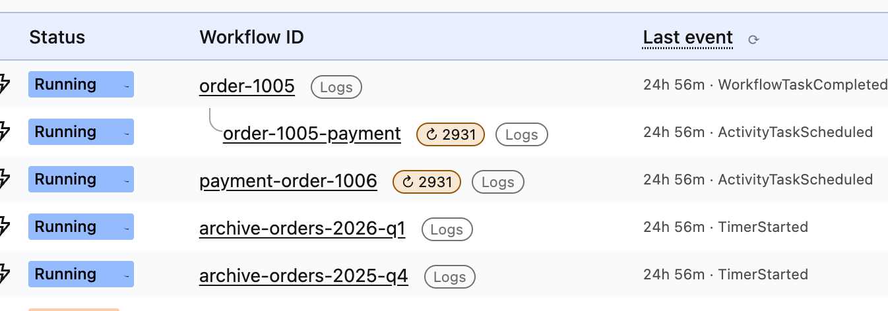
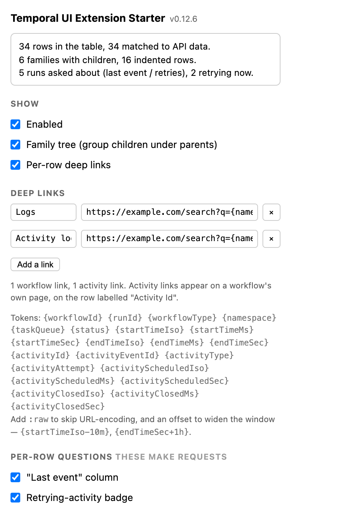
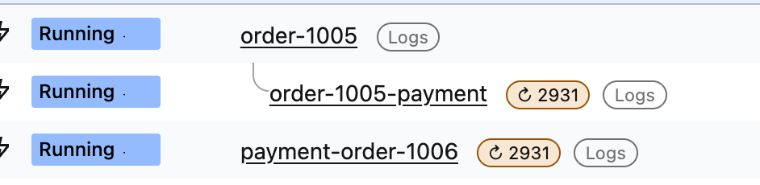
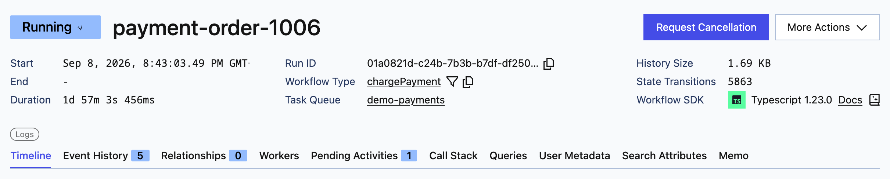
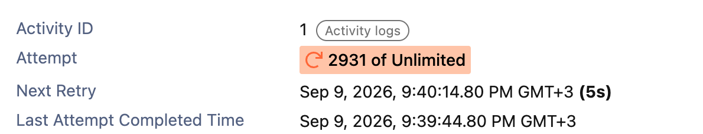

# 02 — techniques

Everything [`../01-family-tree/`](../01-family-tree/) does, plus:

- **deep links to your own tools** — per-row buttons  built from URL templates you
  type, with the workflow id, run id, type, status and a *widenable* time window;
- **the same links on a single workflow's own page**, and one set per activity the page
  mentioned, from the same templates;
- **a settings pane**, so all of the above is configuration rather than a fork;
- **two facts the workflow list does not carry** — what each running workflow did most
  recently, and whether one of its activities is stuck in a retry loop.

The column and the badge appear on the rows that are running, and only those — a closed
row is never asked about:



The last two are the interesting ones: **they are the first thing in this repository
that makes a request of its own.** Everything in 01, and the deep links here, read
responses the page had already fetched. The column and the badge ask Temporal questions
the page never asked. That is a different trust argument, and most of this file is about
it.

Every feature has its own toggle, and there is a master switch that removes every node
this extension put on the page **and puts the row order back** — so "off" is verifiable.

**It still decodes no payload.** Nothing here reads a workflow's input, its result or a
failure message; everything on screen is derived from event *metadata* — event types,
ids, timestamps, attempt counts, activity type names. No codec server, nothing POSTed
anywhere, and no setting that could add one. Identifiers leave by one route only — the
deep link you click. Payloads belong to [`../03-payloads/`](../03-payloads/), whose
manifest is identical to this one.

## Run it

```bash
npm install          # from the repository root, once
npm run build        # from this directory
```

`chrome://extensions` → **Developer mode** → **Load unpacked** → select
`02-techniques/dist/`. Open a workflow list, reload the tab, and click the toolbar icon.
The popup reports rows *seen* and rows *matched* separately — "the extension is not
running" and "it ran and matched nothing" look identical on the page — and how many runs
this tab has asked Temporal about. Under that come every toggle and every link template,
with the tokens a template may use listed beneath them:



Two projects loaded at once are distinguishable by their icons — each carries its own
number and hue. The Node range `npm install` needs is in
[the root README](../README.md#start-with-01).

## Read these files in order

To answer *"what does it ask, and who decides?"* — the only question that changes
between 01 and 02 — read four files in this order.

| # | File | The question it answers |
|---|---|---|
| 1 | [`src/apiInject.ts`](src/apiInject.ts) | Which messages this extension accepts from the page at all. One, and the list is the file. |
| 2 | [`src/rowInfo/rowInfoServe.ts`](src/rowInfo/rowInfoServe.ts) | Whether a request happens: everything that keeps a per-row feature from becoming a load generator, on this side of the boundary rather than in the caller. |
| 3 | [`src/page/temporalApi.ts`](src/page/temporalApi.ts) | What the request *is* — every URL this extension builds, as pure string work. No `fetch` in the file. |
| 4 | [`src/page/pageApi.ts`](src/page/pageApi.ts) | Where authority is enforced: one exported fetch, spending the page's own bearer on an origin **it** picks, and only for a run the page was itself handed. |

Then the drawing side: [`src/render.ts`](src/render.ts) finds the table, identifies
rows and orders families; [`src/rowInfo/rowInfoRender.ts`](src/rowInfo/rowInfoRender.ts)
draws the column and the badge; [`src/links/linkRender.ts`](src/links/linkRender.ts)
draws the anchors, on both pages. The tests worth reading:
[`tests/unit/apiInject.spec.ts`](tests/unit/apiInject.spec.ts), which asserts the request
gate from the attacker's side, and [`tests/unit/render.spec.ts`](tests/unit/render.spec.ts),
which asserts that a repeated pass writes nothing and that the master switch removes
everything, row order included.

Most of 01's source is here byte-for-byte — the tree fold, the row index, the fetch hook
and the shared types. `src/render.ts` is split into
the table plumbing plus the two drawing modules above, with the class names and the
left-to-right order of the controls in the workflow-id cell in
[`src/decoration.ts`](src/decoration.ts); `src/content.ts` wires the settings, the
request client and the single-workflow page. Everything else is new, in a directory
named after the thing it does — see **Layout**.

## The two questions it asks Temporal

### "Last event" — a column beside the workflow id

For every **running** row: the newest history event, as an age and a type —
`3m 00s · ActivityTaskStarted`. One `GetWorkflowExecutionHistoryReverse` with
`maximumPageSize=1` per run, so a workflow with a hundred thousand events costs what a
three-event one does. The direction matters: the *forward* route with one event returns
the workflow's **first** event — the same shape, a different fact, and no error to say
so.

The column sits immediately after the workflow id and is placed on every pass from each
row's own id cell. `syncLastEventColumn` in
[`src/rowInfo/rowInfoRender.ts`](src/rowInfo/rowInfoRender.ts) keeps the table
rectangular (a missing cell would put every header one column out) and the placement
idempotent (moving a cell already in place is a DOM write, and a DOM write wakes the
`MutationObserver` that triggered the pass). The cell distinguishes `…` not asked yet,
`!` asked and failed (reason in the title) and `—` no events.

**The age is exact to the second, and frozen at the reading.** Exact, because `4m 12s`
and `12s` say different things about the same `Running` status. Frozen, because the cell
claims *"event #42 happened 3m 00s ago"* **and** *"#42 is the newest event"*, and only
the first stays true between reads — a ticking clock over a fact re-read every 35s would
draw a convincing stall for a workflow that moved on. Ages are measured against the
instant Temporal was actually read, so the column changes when the data does and at no
other time. Two units, floored, zero-padded — `47s`, `3m 07s`, `5h 12m`, `3d 04h`.

The **refresh button**  **in the column header** re-asks Temporal now for every running row on screen,
as one flag (`fresh`) on the message the table world already sends. **The floor is on
the receiving side**: `FRESH_FLOOR_MS` lives in
[`src/rowInfo/rowInfoServe.ts`](src/rowInfo/rowInfoServe.ts), not in the button, because
the button is one `postMessage` away from anything else in the page. A held-down
refresh, or a script forging the message in a loop, collapses into the same cache the
automatic path uses.

### "↻ 47" — the retrying-activity badge

A workflow whose activity has failed forty-seven times is still `Running`, and in the
list it looks exactly like one that is making progress. The badge is that number — the
attempt count and nothing else, no failure message, no activity id:



It needs `DescribeWorkflowExecution`: `pendingActivities` is returned by that call and
by nothing else. It is not in the list response, and it cannot be reconstructed from the
history tail — an activity on attempt 900 had its `ActivityTaskScheduled` event written
~900 events ago. Attempt 1 never badges; a workflow with several retrying activities gets
one badge, for the worst of them.

**The badge does not read the failure message.** `pendingActivities[].lastFailure.message`
sits beside `attempt`, and it is declined on purpose: a failure message is application
data — account numbers, customer ids, upstream response bodies — and it would be the one
thing on screen a bystander must not read. The attempt count, the activity **type** (a
symbol from the workflow's own source) and the next-retry time are enough to find a stuck
workflow. `activityId` is skipped for the same reason: it is chosen by the caller and is
regularly built out of a business identifier. The hover text says so in place.

### What the requests cost, and what bounds them

| Rule | Why |
|---|---|
| **Running rows only** | A closed workflow's last event and pending activities cannot change. A list filtered to `Completed` makes no requests at all. |
| **Rows the table is showing**, not the whole response | The page fetches more rows than it draws. |
| **One field, one call** | The two toggles are separate, so a user who wants only the column pays one request per running row and not two. |
| **Answers cached 30s** in the page world | `TTL_MS`, `src/rowInfo/rowInfoServe.ts`. |
| **Asked at most every 35s** per run in the table world | `ASK_INTERVAL_MS`, `src/rowInfo/rowInfoClient.ts`. A request answered *from* cache is still a `postMessage` per row per render pass, and there are many render passes. |
| **Four requests at a time** | `maxConcurrent`, `src/page/pacer.ts`. A hundred-row list becomes a queue, not a burst. |
| **429/503 backs off**, honouring `Retry-After` | 2s doubling to a 60s ceiling, or the server's own `Retry-After`. |
| **No polling timer, and no heartbeat** | Refresh comes from the Temporal UI polling its own list, which re-renders the table, which asks again — and the TTLs decide whether asking turns into fetching. |
| **A manual refresh is floored at 5s** per run | `FRESH_FLOOR_MS`. The `⟳` bypasses the 30s cache; this is the bound on how far. |

Each bound has a test that counts requests: `tests/unit/rowInfoClient.spec.ts`,
`tests/unit/apiInjectRowInfo.spec.ts`, `tests/unit/pacer.spec.ts` and
`tests/unit/renderRowInfo.spec.ts`.

**It reads; it never writes.** There is no signal, no terminate, no reset, no update
anywhere in this project.

## Deep links, including per-activity ones

A link is a label and a URL template, and it is drawn as a button on the row —
 is the label the shipped default carries. Tokens are filled from the row:

`{workflowId}` `{runId}` `{workflowType}` `{namespace}` `{taskQueue}` `{status}`
`{startTimeIso}` `{startTimeMs}` `{startTimeSec}` `{endTimeIso}` `{endTimeMs}`
`{endTimeSec}` — and, on an activity, `{activityId}` `{activityType}`
`{activityAttempt}` `{activityScheduledIso}` `{activityScheduledMs}`
`{activityScheduledSec}`.

Time tokens take an offset — `{startTimeIso-10m}`, `{endTimeIso+1h}` — because the window
you want in a log tool is rarely exactly the workflow's own.

**A template's scope is derived from the tokens it uses.** Mention any activity token and
it is an activity link, appearing once per activity on a workflow's page; everything else
is a workflow link. A misspelled `{activityTyp}` is therefore a *visible* unknown token on
a workflow link, not a template silently moved to another page. `templateScope` in
`src/links/deepLink.ts` is the whole rule. A template that expands to something that is
not `http(s)` does not become a link; it is rendered inert, with the reason in its title.

## The links on a single workflow's page

Two sites, both **inside the UI's own layout**. The workflow-scoped links sit in a bar
beside the page's own tabs:



The activity-scoped links are appended to the value of the row the UI labels
**"Activity Id"**, in each activity panel the reader has opened — once per activity, and
only when the id resolves to exactly one:



**It fetches nothing.** Everything comes from the history and describe responses the page
fetched for itself, folded in the page's world by `src/detail/detailWatch.ts` and posted
across. No request, no cache, no pacing — and no ledger check, because this feature never
spends the page's bearer. The consequence is visible: on a tab that was already sitting
on a workflow when the extension loaded, the bar says it has observed nothing and asks
for a reload.

Three rules:

- **An activity is identified by its id, never by its type.** A run that calls
  `ChargeCard` three times has three activities of that type, and a link keyed on the
  type would open a search matching all three. `activityByPanelId` in
  `src/detail/detail.ts` resolves the id the panel is showing to one activity —
  `activityId` first, `scheduledEventId` (assigned by Temporal, so never repeated) as the
  fallback. An id resolving to nothing gets **no link**; an id that is not unique says so
  in its title.
- **Anchor to meaning, then make the failure visible.** The tab bar is found as "the
  list containing a link to this workflow's history", and the activity row as "the row
  the UI labelled Activity Id" — the UI's own names, not class names or positions. A bar
  that cannot find the layout is parked where it can be **seen**, the popup says so in
  words, and every pass looks for the real anchor again.
- **Fold before posting.** A raw history event carries `input`, `result` and `failure`;
  `src/detail/detail.ts` keeps ids, type names, timestamps and attempt counts, and
  nothing else, so none of that reaches the page's message bus.

## Security card

| | 02 — techniques |
|---|---|
| **Permissions requested** | `storage`, and nothing else |
| **Host permissions** | none |
| **Runs on** | `https://cloud.temporal.io/*`, `http://localhost/*`, `http://127.0.0.1/*` |
| **Service worker** | none |
| **Data it reads** | the workflow-list response the page had already fetched; the table's own `href`s; the history and describe responses a single workflow's page fetches for itself; and, per running row, one history-reverse event and one workflow description. No cookies, no `localStorage` |
| **Data it writes** | `chrome.storage.sync` — your toggles and link templates. No cookies, no `localStorage`, no files |
| **Requests it makes** | **yes — see below.** Up to two per *running* row, to the page's own Temporal API, paced and cached. Nothing else, to nowhere else |
| **Data that leaves the machine** | **identifiers, and only through a link you click.** A deep-link template puts a workflow id, a run id, an activity type and a time window into a URL on a host you named, and clicking it navigates your browser there. Nothing is posted, nothing is sent on render, and no credential goes with it |
| **Payloads it decodes** | none |
| **Credentials it holds** | none. The page's `Authorization` header is read in the page's world and re-sent to Temporal's own API only; it is not stored, posted to the extension, or logged — and no setting can change that |
| **Whose data it will fetch** | only the runs the server listed to this page, tracked per namespace. A request naming any other run is refused *before* the page's token is spent on it — see [the weakness](#the-weakness-and-what-closing-most-of-it-took) |
| **Third-party code in the bundle** | three packages — `valibot`, `p-limit`, and `yocto-queue` behind it. See [Dependencies](#dependencies) |

### The row that matters: it originates requests

**A permission diff is not a capability diff.** Going from 01 to 02 changed no manifest
key beyond `storage`, and yet 02 makes requests of its own. Why it is still a small step:

- **It cannot reach anything the user could not.** The request goes to the same API the
  page is already driving, over the page's own session, and returns what the UI itself
  shows when you open that workflow.
- **A host permission would not help, so none is asked for.** Chrome: *"Cross-origin
  requests are always treated as such in content scripts, even if the extension has host
  permissions."* On Cloud the API is on the per-tenant host, so the call is cross-origin
  for the page too and succeeds only because that host names the page's origin. The
  fetch therefore lives in the page's world. The API prefix is derived from a URL the
  page was observed to fetch, never assumed — Cloud and self-hosted differ.
- **The token never leaves the page world, and reaches only Temporal.** It is held in
  one closure in `pageApi.ts` and attached to those two requests — never put in a
  `postMessage`, never written to storage, never logged.
- **There is one gate, not one per feature.** `fetchForListedRun()` is the only route
  to the page's `Authorization` header, and it performs the ledger check itself.

### The weakness, and what closing most of it took

**The message bus is not authenticated.** `window.postMessage` carries no sender identity
that cannot be forged: `event.source === window` means "somebody in this page", which
includes the Temporal UI, any npm dependency of it, and **any other installed extension's
content script**. `MESSAGE_SOURCE` and every field of the request are published in this
repository, so a shape check says a message is well-formed and nothing about who sent it.

`pageApi.ts` holds authority its caller does not — the page's origin and the page's own
`Authorization` header. Answering any `(namespace, workflowId, runId)` it was given would
let a forged message spend your bearer on any workflow in any namespace you have access
to. What closes that:

- **The ledger.** A question is answered only for a run the **page itself was handed**,
  in the namespace it was handed it under — learned by parsing the workflow-list
  *response* in the same closure, not from `inject.ts`'s `workflows` message, which is
  forgeable by the same script.
- **Nothing else holds the token.** `fetchForListedRun` picks the origin itself and takes
  a *route builder*, not a URL, and there is no second exported fetch in this build.
- **An answer is kept only for a question this side asked.** The reply crosses the same
  bus into the half that renders: `isRowInfoResult` validates every field to the leaves,
  and `rowInfoClient.ts` drops anything whose `(namespace, workflowId, runId)` it did not
  ask about.

**What is left.** A script already in your page can forge a `row-info-request` naming
any run the page's own list responses handed the ledger — not only the rows on screen,
up to `MAX_RUNS_PER_REQUEST` at a time — and read the `row-info-result` off the bus:
last-event type and age, pending-activity attempt counts, activity type names. What that
is worth depends on who sends it. **MAIN-world code** — the Temporal UI, any dependency
bundled into it — already holds the page's bearer and can ask Temporal itself, so for it
this is quota noise rather than an escalation. **Another extension's ISOLATED-world
content script** cannot read the bearer, so for it the forged request is a way to obtain
that metadata it could not fetch on its own — bounded to metadata about runs the page
already fetched, but a residual rather than nothing. Closing it needs the request to
arrive by a channel a page script cannot write — `chrome.scripting.executeScript({world: 'MAIN'})` from a
service worker, and therefore `host_permissions`, the grant this repository is about not
asking for. The `answering only for runs the page itself listed` block of
`tests/unit/apiInject.spec.ts` asserts each refusal from the sender's side, and that
**no request reached the network**.

Every value this extension writes reaches the DOM through `textContent`. An activity type
name and a workflow id are authored by whoever started the workflow, and this extension
renders them inside a page it does not own.

## Dependencies

| Package | Version | What it is for |
|---|---|---|
| `valibot` | 1.4.2 (MIT) | Runtime schema validation at every boundary — the page's own list, history and describe responses, the `postMessage` in both directions, and each stored settings object read back out of `chrome.storage.sync`. In all four bundles |
| `p-limit` | 7.3.2 (MIT) | The concurrency limit under the per-row questions: at most four requests to Temporal's API in flight at once. In `dist/apiInject.js` only |
| `yocto-queue` | 1.2.2 (MIT) | `p-limit`'s queue. Nothing of ours imports it |

**What stays ours** is the part a package cannot do. For `valibot`: the schemas, and the
fact that validating a message's shape says nothing about who sent it —
`src/content.ts` still checks `event.source` itself, and `fetchForListedRun()` still
decides whose data may be fetched. For `p-limit`: every rule that is about *Temporal*
rather than about counting — `src/page/pacer.ts` owns both forms of `Retry-After`, the
ceiling on how long a server may ask us to wait, the exponential fallback when it asks for
nothing, and the rule that resuming is not a burst.

The dependency policy is in the [root README](../README.md#dependencies); the
comparisons that chose these packages are in
[`docs/design-notes.md`](../docs/design-notes.md#dependencies).

## Layout

`src/` is grouped by lesson. Its root holds the bundle entry points — the three the
manifest loads plus the popup's — and the modules every lesson touches; each directory
below them is one thing the extension does. `src/family/` is stage 01 unchanged.

```
src/
  inject.ts         MAIN world — wraps window.fetch, posts the list rows it sees
  apiInject.ts      MAIN world — every message accepted from the page, in one switch
  content.ts        ISOLATED world — wiring, and nothing else
  popup.ts          the toolbar popup, including "is it working?"
  render.ts         the table: finding it, identifying rows, ordering families
  decoration.ts     every root class and shared name the writers use
  settings.ts       chrome.storage.sync
  types.ts          the shapes crossing the postMessage boundary
  page/             the boundary with the page's own Temporal API
    pageApi.ts      the bearer, the ledger, the response-watcher seam, and the ONLY
                    function in this build that issues a request
    temporalApi.ts  pure: the API prefix and the two route builders
    pacer.ts        concurrency cap + 429/503 backoff, with the clock injected
  family/           the tree, as pure functions — stage 01, unchanged
    rows.ts         API response → a flat row shape
    tree.ts         rows → ordered rows, each with its connector
  rowInfo/          the two features that cost a request
    rowInfo.ts      pure: the questions, the answers, and what a badge may say
    rowInfoClient.ts  ISOLATED world — which rows are worth asking about, and what
                    came back
    rowInfoServe.ts MAIN world — answers them: cache, then the pacer
    rowInfoRender.ts  the column and the badge, drawn from those answers
  links/
    deepLink.ts     URL templates: tokens, offsets, scope, and what may become an href
    linkRender.ts   the anchors — the only <a> this extension writes, both pages
  detail/           one workflow's own page
    detail.ts       pure: URL rules, the folds behind the links, and which activity
                    an id on the page resolves to
    detailWatch.ts  MAIN world — folds the page's own responses, fetches nothing
    detailLinks.ts  the links themselves, in the UI's own layout
public/
  manifest.json     one permission: storage
  popup.html        the settings pane (no inline script — MV3 forbids it)
  content.css       connectors, buttons, column, badge, link bar
  icons/            generated: this project's number and hue, not a committed image
tests/              the ordering rules, the DOM bugs that cost the most, and the
                    request gate — including the cases that fail SILENTLY
```

`src/rowInfo/rowInfo.ts` and `src/page/temporalApi.ts` are pure and therefore testable;
`src/page/pageApi.ts` is the only file that issues a request; the only files that write
to the page are `render.ts`, the two `*Render.ts` modules it calls,
`src/detail/detailLinks.ts` and one line in `src/content.ts`
(`grep -rlnE 'createElement|classList' src/` is the check; the one other name it returns
is `src/popup.ts`, which writes to the popup's own document). **Reviewing "what can this
thing send" means reading one file.**

## What it deliberately does not do

**No payload is decoded here.** Input and result on hover, through a codec server, are
[`../03-payloads/`](../03-payloads/). The conveniences are
[`../04-ui-goodies/`](../04-ui-goodies/);
[the root README lists them](../README.md#stage-04--the-conveniences).

## Commands

| Command | What it does |
|---|---|
| `npm run build` | Bundle `src/` into `dist/`, copy `public/` over it |
| `npm run watch` | Rebuild on change (does **not** re-copy `public/`) |
| `npm test` | Unit + jsdom specs |
| `npm run typecheck` | `tsc --noEmit` over `src/` and `tests/` |
