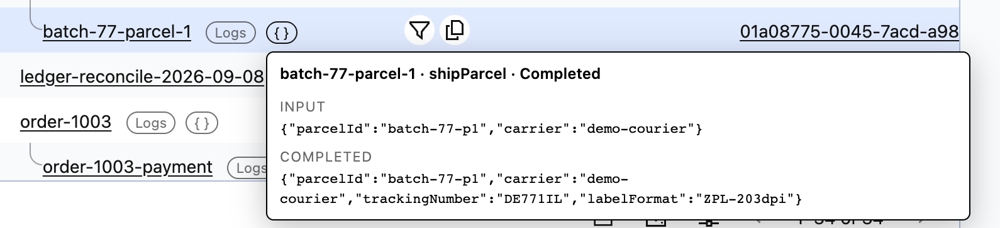
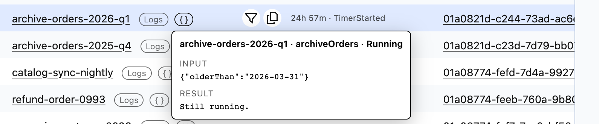
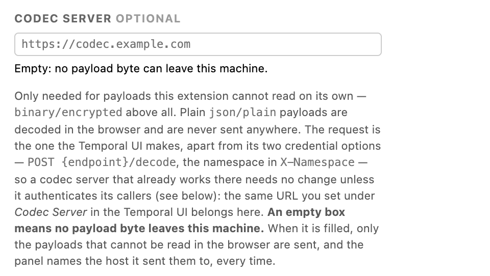
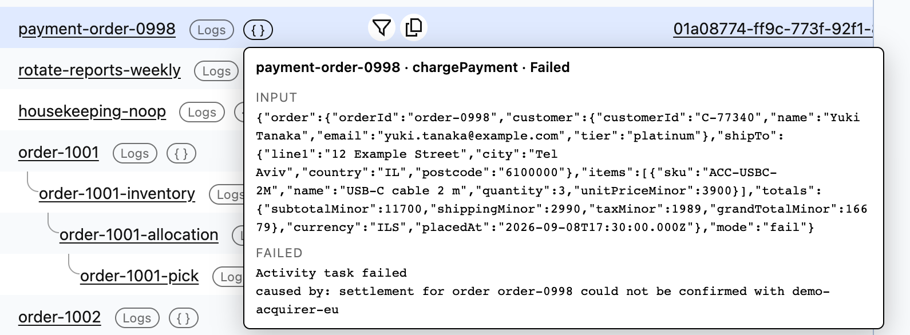

# 03 — payloads

Everything [`../02-techniques/`](../02-techniques/) does, plus the one thing most teams
actually came for: **a workflow's input and result on the row it belongs to.** A `{ }`
 button on every row, hovered to read what the workflow was started
with and what it returned or why it failed — decoded through your own codec server when the payload is
encrypted, with the host that decoded it named on screen every time.

A closed row asked two questions — its first event and its last — and both answers are
the payload's own bytes, wrapped by the panel and reformatted by nothing:



The payload is shown on one line like that on purpose: **valid UTF-8 handed through with
no JSON parsing and no re-indentation**. Bytes that are not valid UTF-8 are labelled and
shown as their base64 rather than guessed at, and anything past `MAX_DISPLAY_CHARS` is
clipped with a count of what was cut — so what is on screen is not always something that
pastes back. Displaying JSON *as* JSON has its own correctness problem and belongs to
[`../04-ui-goodies/`](../04-ui-goodies/), [stage 04](../README.md#stage-04--the-conveniences),
which built the viewer it needs.

**Three things arrive at once here**, which is why it is a stage of its own: the
extension decodes payloads for the first time, sends a request body to a host of your
naming for the first time — 02 can only put identifiers in a link for you to click; this
POSTs payload bytes on hover — and for the first time puts a panel on screen that can hold
somebody's personal or financial data.

**And the manifest asks for exactly what 02's does** — one permission, `storage`, no
`host_permissions`, no service worker, the same three content-script matches. A `diff` of
the two files shows the name, the description, the version and a tooltip. **A permission
diff is not a capability diff**, and the largest capability step in this repository is
the one the manifest does not record.

## Run it

```bash
npm install          # from the repository root, once
npm run build        # from this directory
```

`chrome://extensions` → **Developer mode** → **Load unpacked** → select
`03-payloads/dist/`. Open a workflow list, reload the tab, hover a `{ }`
. The Node range
`npm install` needs is in [the root README](../README.md#start-with-01).

With no codec server configured — the default — an encrypted payload says so and **no
payload byte has left your machine**: with that field empty this build sends nothing 02
would not. Plain payloads are readable without one; many self-hosted setups never encrypt
them at all.

## Read these files in order

To answer **"what can this thing send, and who decides?"** — the only question that
changes between 02 and 03 — read four files. Each states its own rules in its header.

| # | File | The question it answers |
|---|---|---|
| 1 | [`src/apiInject.ts`](src/apiInject.ts) | Which messages this extension accepts from the page at all. Two, and the list is the file. |
| 2 | [`src/payloads/payloadServe.ts`](src/payloads/payloadServe.ts) | Whether a request happens: the ledger gate, one history event, and the decision that a payload needs a server. |
| 3 | [`src/payloads/codec.ts`](src/payloads/codec.ts) | What the request *is* — destination, headers, body — and what is deliberately not in it. |
| 4 | [`src/page/pageApi.ts`](src/page/pageApi.ts) | Where authority is enforced: two exported fetches, one spending the page's bearer on an origin it picks, one carrying no credential to an origin the caller picks. |

Then the panel — [`tooltip.ts`](src/payloads/tooltip.ts) for the element and the gesture,
[`payloadClient.ts`](src/payloads/payloadClient.ts) for which answer may be believed —
and two specs: [`tests/unit/codec.spec.ts`](tests/unit/codec.spec.ts) for the endpoint
policy, and [`tests/unit/apiInjectCodec.spec.ts`](tests/unit/apiInjectCodec.spec.ts) for
every egress claim, asserted from the attacker's side.

Beyond `src/payloads/`, the files that differ from 02: `apiInject.ts` accepts a second
message; `src/page/pageApi.ts` gains the credential-free fetch;
`src/rowInfo/rowInfoServe.ts` shares one pacer instance instead of building its own;
`render.ts` ranks the new button into the cell's control order; `decoration.ts` names
the panel so the master switch can sweep it; `content.ts` drops the decoded-payload cache
when the master switch or the codec setting changes; `settings.ts` and `popup.ts` carry
the one field that names a host. Everything else is 02 byte-for-byte.

## What one hover costs

| Rule | Why |
|---|---|
| **Nothing is fetched on render** | A hundred-row list costs zero requests; the only entry points are `pointerover`, `focusin` and `click`, and a traverse asks only about the row you stopped on. The header's `⟳` re-asks the two per-row questions but does **not** re-decode. |
| **One history event per question** | `maximumPageSize=1`. Input is the first event, the outcome the last; a **closed** row asks two questions, a running one says *"Still running."* without asking. |
| **One question is one request** | A click fires `focusin` **and** `click`; a question already in flight is *joined*, never duplicated. |
| **Answers are cached, bounded, evictable** | Keyed by `(namespace, workflowId, runId, kind)`; errors are not cached. The bound exists because the values are decoded payloads: an unbounded cache is a tab retaining every customer record its owner glanced at. |
| **It shares ONE pacer with the per-row questions** | Four **Temporal** requests in flight for the whole extension, 429/503 backoff honouring `Retry-After`; the instance is a module-level `const` in `src/page/requestPacing.ts`. The codec POST is outside that cap, so a slow decoder cannot occupy a slot that exists to be polite to Temporal. |
| **A question that is never answered gives up** | `REQUEST_TIMEOUT_MS`, with a message saying to reload the tab. |

A running row costs one question; the result section says so without asking one:



## What is readable without any server

`json/plain`, `binary/plain`, `text/plain` and `binary/null` are decoded in the browser
and **never sent anywhere**. Everything else — `binary/encrypted` above all — is what a
codec server is for. `json/protobuf` is deliberately not in that set even though it is
not encrypted: decoding it needs the message descriptor, which this extension does not
have and a codec server usually does.

Three rules in [`src/payloads/payloads.ts`](src/payloads/payloads.ts):

- **Match on the attributes key, not on `eventType`** — the same event is
  `WorkflowExecutionStarted` from one Temporal version and
  `EVENT_TYPE_WORKFLOW_EXECUTION_STARTED` from another, while
  `workflowExecutionStartedEventAttributes` is one string in both.
- **No JSON parsing and no reformatting.** `JSON.parse` makes every number an IEEE
  double, so an id of `12345678901234567890` comes back as `12345678901234567000` —
  wrong in a way that looks exactly like real data. `decodePayload` does base64, then
  UTF-8, then stops.
- **A history it cannot read says so, rather than looking empty.** Where that line
  falls is proto3's JSON mapping: `null` is a legal encoding of an unset message field,
  so absent and `null` mean *recorded nothing*, while a scalar or array container means
  *cannot read this response*. A malformed list is rejected whole and never filtered.

## The codec server

One field in the popup, empty by default. **An empty field means no payload byte can
leave this machine**, and it is the only place an endpoint can come from — nothing is
read off the page, nothing is guessed from the namespace. The one setting that names a
host, as shipped:



The request is the one Temporal's own UI makes, **minus its two credential options**:
`POST {endpoint}/decode`, the namespace in `X-Namespace`, `{"payloads": […]}` in and
out. A codec server that already serves the Temporal UI needs no change to serve this.
The one thing this extension cannot do is a codec server that authenticates its callers.

What bounds it:

- **Only the payloads that cannot be read here are sent.** A workflow started with a
  plaintext customer record *and* one encrypted blob has only the blob POSTed:
  `planCodecCall` carries the positions and `mergeDecoded` puts the answers back.
- **https, or http on loopback. Nothing else.** A codec server hands back *decrypted*
  data, so plain http to anywhere but this machine would put exactly that on the wire in
  the clear. An endpoint that fails the rule is treated as no endpoint at all, and the
  popup says so before anything is hovered.
- **No credential is reachable on that path, and there is no option to add one.**
  Temporal's own UI has both switches — pass the token, send cookies. Here the endpoint
  arrives over `postMessage`, which anything on the page can send, so there is no flag to
  forge: `codecDecodeCall()` *describes* the request and its return type has no
  `credentials` field; `fetchFromPageWorld()` *spends* it, writing `credentials: 'omit'`
  as a literal and refusing an `Authorization`, `Cookie` or `Proxy-Authorization` header
  outright.
- **The host is named in the panel, every hover** — "decoded" alone reads as if the
  extension had done it locally.
- **The ledger still gates it**: a payload can be asked about only for a run this page
  itself listed, checked before any request is issued. A codec server's own 429 does not
  pause Temporal requests.

**Both fetches are made from the page's world**, because a content script cannot make
either: Chrome treats a content-script fetch as cross-origin even with host permissions.
A codec server configured with `Access-Control-Allow-Origin: https://cloud.temporal.io`
for the Temporal UI therefore already admits this extension — the page's origin in both
cases, never ours.

## The hover panel

[`tooltip.ts`](src/payloads/tooltip.ts) owns the element and the gesture: hover intent
that remembers *which* button it is waiting for, a panel that does not close under the
pointer or under a drag-selection, a generation stamp so a late answer cannot paint into
the panel that replaced it, and a switch-off that takes the node, the reference **and**
the text — the panel lives on `<body>`, where no render pass looks.
[`payloadClient.ts`](src/payloads/payloadClient.ts) owns which answer may be believed: an
answer has to name the question it answers on all four key fields, one question is one
request, no answer outlives the setting it was decoded under, and a request that never
comes back still resolves. The reasoning behind each rule is in
[`docs/design-notes.md`](../docs/design-notes.md#the-payload-panel).

What "result" means for a failed run is the failure message — the first thing on screen
in this repository that is somebody's application data:



The button carries **no row identity** — no workflow id, no run id, not even a title that
names one — which is what makes it correct under `<tr>` recycling: the panel resolves the
row from the row's own `href` at the moment of the hover. It is a real `<button>`, so Tab
opens it and Escape closes it; `role="tooltip"`, `aria-live="polite"`, and every value
reaches the DOM through `textContent` inside a `<pre>`.

## Security card

| | 03 — payloads |
|---|---|
| **Permissions requested** | `storage`, and nothing else — **the same permission surface as 02** |
| **Host permissions** | none |
| **Runs on** | `https://cloud.temporal.io/*`, `http://localhost/*`, `http://127.0.0.1/*` |
| **Service worker** | none |
| **Data it reads** | everything 02 reads, plus **the payloads themselves**: one history event per question, decoded into a workflow's input, its result, its failure message and stack trace, a termination reason |
| **Data it writes** | `chrome.storage.sync` — toggles, link templates, the codec endpoint. **No payload is ever written to storage**; decoded text lives in one bounded in-memory cache for the life of the tab, and switching the panel off empties it |
| **Requests it makes** | up to two per *running* row for the `Last event` column and retry badge — plus **one history event per payload question** (one for a running row, two for a closed one), on hover only. All to the page's own Temporal API. And, when you have named one, `POST {your codec server}/decode` |
| **Data that leaves the machine** | **yes, and this is the row that changed.** Only when you have typed a codec endpoint: the *undecodable* payloads of the row you hovered, plus the namespace in `X-Namespace`, to that host and nowhere else. Never a payload this extension could read itself; never a decoded one; never row metadata; never a credential. With the field empty, no payload byte goes anywhere |
| **Payloads it decodes** | yes — that is the feature. `json/plain`, `binary/plain`, `text/plain`, `binary/null` in the browser; anything else through your codec server, or not at all |
| **Credentials it holds** | none. The page's `Authorization` header is read in the page's world and attached **only** to Temporal's own API — no parameter, setting or message field can attach any credential to a codec request |
| **Whose data it will fetch** | only the runs the server listed to this page, tracked per namespace — the same single ledger, now also gating the hover |
| **Third-party code in the bundle** | the same set as 02, and none of it builds or sends the codec request. See [Dependencies](#dependencies) |

### The row that matters: data leaves the browser

- **What is sent, in full:** the payloads that could not be decoded here — `metadata`
  and `data` exactly as Temporal returned them — in a `{"payloads": […]}` body, with the
  namespace in `X-Namespace` and `Content-Type: application/json`. No other header, no
  query string, no other body field.
- **Where it goes:** a host the user typed, in their own browser, named on screen next to
  the data it decoded.
- **What is not sent:** anything readable, any decoded text, the page's bearer, any
  cookie, row metadata, the workflow id, the run id, the ids of rows you did not hover,
  and anything whatever before you fill the field in.
- **It is off until it is configured**: with the endpoint empty there is no host to send
  to and the code path does not exist.

Every clause is asserted from **outside** the extension in
[`tests/unit/apiInjectCodec.spec.ts`](tests/unit/apiInjectCodec.spec.ts), against a fake
network that records the URL, the headers and the **body** of everything that reached it.

### The weakness, and what closing most of it took

**The message bus is not authenticated.** `window.postMessage` carries no sender identity
that cannot be forged, and two different senders qualify. **MAIN-world code** — the
Temporal UI itself, or any npm dependency bundled into it — executes *as* the page, with
the same heap, the same in-memory bearer and the same same-origin `fetch`. **Another
installed extension's ISOLATED-world content script** shares the page's DOM and therefore
its `postMessage` bus, but not its JS state: it cannot read the bearer out of the UI's
memory, and its own `fetch` is cross-origin regardless of its host permissions.

Three things narrow it: the **ledger** (`fetchForListedRun()` is still the only route to
the `Authorization` header and checks the ledger itself — **one gate, not one per
feature**); the **second fetch carrying nothing**, with deliberately no `auth: true`
parameter to add; and validation **in the other direction**, because the answer crosses
the same bus into the half that renders.

**What is left.** Either sender can forge a `payload-request` and get: any run the
ledger has retained, not only the rows on screen; without a gesture, because it is our UI
that requires one and not the bus; the **plaintext** back over `postMessage` for
everything decodable locally; and the **ciphertext** out to a host it names. For
MAIN-world code that bound is real — it already holds the bearer and can reach all of it
by a shorter route. For an installed extension's content script the bound **does not
hold**, and that is the residual risk. `fetchFromPageWorld()`'s own type closes the
credential half — it accepts neither an `Authorization` header nor a cookie as a
parameter — but it closes neither the read nor the directed egress of ciphertext.

Closing it needs the *request*, not only the endpoint in it, to arrive by a channel a
page script cannot write: `chrome.scripting.executeScript({world: 'MAIN'})` from a
service worker, and therefore `host_permissions` — **a bigger permission budget in
exchange for a smaller attack surface.** The header of `src/payloads/payloadServe.ts` carries the
short form and points here.

Two smaller limits. `safeCodecEndpoint` returns the string you typed rather than a
normalised `href`, so a relative segment still resolves and
`https://codec.example.com/base/../other` posts to `/other/decode` — surprising, same
origin, not a leak. And switching the feature off is not a revocation: a payload already
POSTed is already there.

### Personal data, deliberately

**This project's purpose is to display the data**, so: nothing is persisted anywhere,
and `console` output names counts and states but never payload text; the in-memory
cache is treated as retained personal data — bounded, and cleared by the payload
switch, the master switch and a change of endpoint, with an epoch bump so a request in
flight under the old setting is discarded too; and every value reaches the DOM through
`textContent` — there is no `innerHTML` anywhere. Egress through this extension's own UI is always a gesture — there is no path
from a render pass to a codec request — while **a forged `payload-request` needs no
gesture**, which is a property of the bus and not of this code.

## Dependencies

| Package | Version | What it is for |
|---|---|---|
| `valibot` | 1.4.2 (MIT) | Runtime schema validation at every boundary, including the two this stage adds: the `postMessage` carrying a decoded payload back, and the codec server's own response |
| `p-limit` | 7.3.2 (MIT) | The four-in-flight ceiling on requests to Temporal's API |
| `yocto-queue` | 1.2.2 (MIT) | `p-limit`'s queue — nothing of ours imports it |

**03 adds no dependency of its own.** This rung does not format a payload at all. **No
third-party library constructs or executes the codec request** — our own code assembles
it, gates it and sends it, and `p-limit` never sees it. `valibot` shape-checks the inbound
`payload-request` before [`src/apiInject.ts`](src/apiInject.ts) acts on it, and the
server's answer on the way back; whose data may be fetched is decided by the ledger, not
by a schema.

The policy behind the choices is in the [root README](../README.md#dependencies); the
comparisons that made them are in
[`docs/design-notes.md`](../docs/design-notes.md#dependencies).

## Layout

`src/` is grouped by lesson: its root holds the bundle entry points and the modules every
lesson touches, and each directory below is one thing the extension does.
`src/payloads/` is new here; the rest is 02's, with the changed files listed
[above](#read-these-files-in-order).

```
src/
  inject.ts         MAIN world — wraps window.fetch, posts the list rows it sees
  apiInject.ts      MAIN world — every message accepted from the page, in one switch
  content.ts        ISOLATED world — wiring, and nothing else
  popup.ts          the toolbar popup, including the codec verdict line
  render.ts         the table, the row identity, the family order, the master switch
  decoration.ts     every root class the writers use, and the list the switch sweeps
  settings.ts       chrome.storage.sync — including the one field that names a host
  types.ts          the shapes crossing the postMessage boundary
  page/             the boundary with the page's own Temporal API — the bearer, the
                    ledger, the pacer instance, and the two exported fetches that
                    must never converge
  family/           the tree, as pure functions — stage 01, unchanged
  rowInfo/          the two columns that cost a request
  links/            URL templates, and the anchors they become
  detail/           one workflow's own page — folds its responses, fetches nothing
  payloads/         this stage — the panel, and the only POST in the repository
    payloadMessages.ts  the two payload messages and their guards
    payloads.ts     pure: what can be read in the browser, and how it is formatted
    codec.ts        pure: the codec request, and what is deliberately NOT in it
    valueGuards.ts  the two narrowings the payload path shares
    payloadButton.ts  the `{ }` button, carrying no row identity
    tooltip.ts      ISOLATED world — the panel and the gesture
    payloadClient.ts  ISOLATED world — one hover's question, and which answer counts
    payloadServe.ts MAIN world — answers one hover: history, then the codec
public/
  manifest.json     one permission: storage — the same as 02
  popup.html        the settings pane (no inline script — MV3 forbids it)
  content.css       connectors, buttons, column, badge, link bar, panel
  icons/            generated from arithmetic, not a committed image
tests/              the ordering rules, the DOM bugs that cost the most, the request
                    gate, and every egress claim — from the attacker's side
```

`payloads.ts` and `codec.ts` are pure and therefore testable; `src/page/pageApi.ts` is
the only file that issues a request; `grep -rlnE 'createElement|classList' src/` lists
every file that can write to the page. One rule there is worth keeping in a fork:
**`fetchForListedRun()` is the only function that can attach the page's `Authorization`
header**, while its sibling `fetchFromPageWorld()` posts to an origin its caller chose
with no credential of ours. The difference between them is who chooses the origin;
collapsing them into one function with an `auth: true` flag would type-check, and is
exactly the change to refuse in review.

## What it deliberately does not do

No copy button, no download, no export, no proxy of ours — each is a second egress path
with its own redaction question. No search or filtering inside payloads. No write to
Temporal, anywhere in any project here. And it does not read the codec endpoint out of
the Temporal UI's own settings — a nicer first run, in exchange for a second trust
question; [the endpoint used to come from the
page](../docs/design-notes.md#the-endpoint-used-to-come-from-the-page) says what to read
if you want it in a fork.

## Commands

| Command | What it does |
|---|---|
| `npm run build` | Bundle `src/` into `dist/`, copy `public/` over it |
| `npm run watch` | Rebuild on change (does **not** re-copy `public/`) |
| `npm test` | Unit + jsdom specs |
| `npm run typecheck` | `tsc --noEmit` over `src/` and `tests/` |
