# 04 — UI goodies

Everything [`../03-payloads/`](../03-payloads/) does, plus the conveniences that make
a long-lived workflow list livable day to day: a lossless JSON viewer for the payload
panel (with a Copy button of its own), column reordering, a page size up to 1,000,
expand-to-families, one-click family focus, a copy button on every column header, and a
NOT filter with Ctrl/Cmd-click additive filtering. Every one of them is presentational —
a different way to look at, move, or copy rows this page already fetched — so it adds
**no new request, no new permission and no new destination.**

The viewer, on an input holding `12345678901234567889` unquoted — drawn exactly, where the
same text through `JSON.parse` reads `12345678901234567000`:


03's panel shows a payload on one unindented line. 04's viewer is indented and always
fully drawn — no expand/collapse, every value on screen the moment the panel opens — with
one colour per token type, and every digit exactly as Temporal sent it: nothing
round-trips through `JSON.parse`, so a 20-digit id cannot be rounded the way an IEEE
double would round it.

**The manifest asks for exactly what 03's does** — one permission, `storage`, no
`host_permissions`, no service worker, the same three content-script matches.
[`src/apiInject.ts`](src/apiInject.ts), the file that lists every message this extension
accepts from the page, is **byte-identical to 03's copy**. Nothing in this stage widens what the page can ask the extension's isolated world
to do; every new capability is a different way to render or reorder an answer the
extension already had a route to.

## Run it

```bash
npm install          # from the repository root, once
npm run build        # from this directory
```

`chrome://extensions` → **Developer mode** → **Load unpacked** → select
`04-ui-goodies/dist/`. Open a workflow list, reload the tab, and:

- hover a row's In 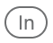 or Out 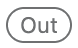 button to open its payload panel, then click **Copy**
  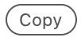 in the panel's own heading row to copy the decoded value it is showing;
- drag a column header's handle  (or focus it and press Left/Right) to reorder columns;
- click the copy button  on a column header to copy that column's visible values;
- hover a Workflow ID, Run ID, Type, Status or Task Queue cell for the
   button beside Temporal's own funnel , and Ctrl/Cmd-click
  either one to add its clause instead of replacing the filter;
- open the page-size dropdown under the table for the new `1000*` option;
- click a row's "Family" 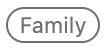 link, or the filter bar's "Expand to families" button.

The codec server field, the deep-link templates and every setting 03 already had work
exactly as they did there — this stage adds a checkbox per new feature to the same
popup, all defaulting to **on**. The Node range `npm install` needs is in
[the root README](../README.md#start-with-01).

## What it looks like

**1. A lossless JSON viewer.** Indented, one colour per token type, and every digit
exactly as Temporal sent it — the payload never passes through `JSON.parse`. It opens
from two buttons on every row, **In**  for the input and **Out**
 for the result, each a request of its own, so hovering one never
fetches the other's history event:

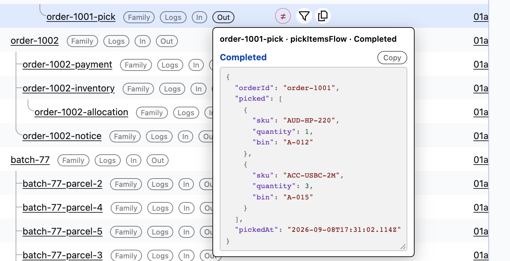

The panel's own **Copy**  button, in the heading row above the value, copies
what the panel is showing at that moment — the decoded payload exactly as drawn.

**2. Column copy.** Hover any data-column header for its copy button  and its
drag handle :

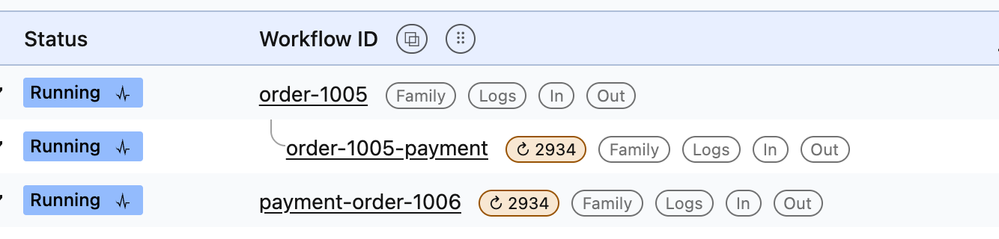

Click the copy button, and it reads the column out of the live table at that moment — the
tick is its receipt:

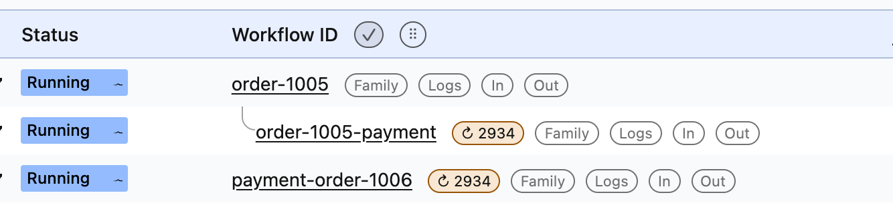

**3. Column reordering.** The right-hand button of the pair is the handle
, and it is the one to take hold of:

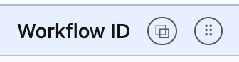

Drag it onto another header. A bar marks where the column will land — here the "Last
event" column this extension added, on its way in front of "Workflow ID":

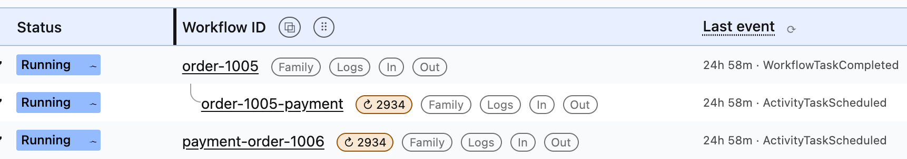

On the drop the real table is reordered, every row's cells with it. Turning the feature
off puts each column back where Temporal drew it:

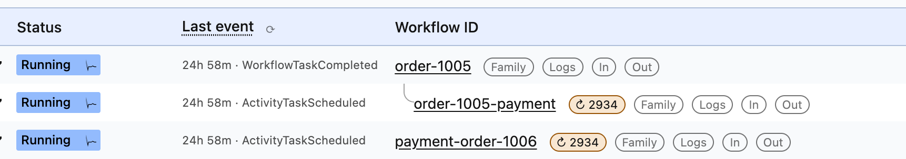

**4. A bigger page size.** The control is Temporal's own, at the left of the pagination bar
under the table, and it offers 100, 250 and 500. The extension appends 1,000 — the
workflow-list API's own per-call ceiling, so there is no point offering more — and marks it
with a `*`, which is how a reader of any dropdown on the page can tell an entry this
extension added from one the site ships:

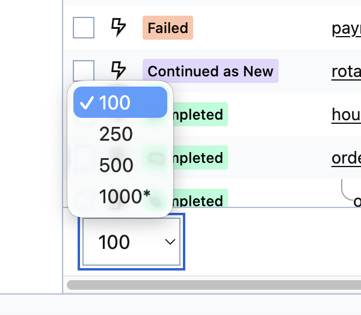

**5. NOT filtering.** Hover an eligible cell for its  button:

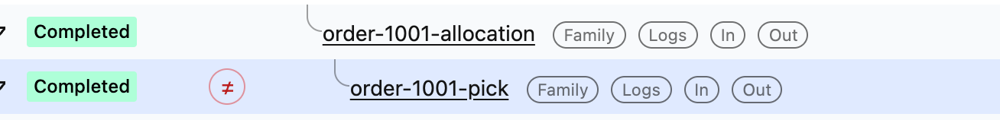

Click it, and every row with that value leaves the list. The status strip above the table
shows what remains — on UI 2.50.1 Temporal's own filter chip draws the negated clause
with `=`, while the URL carries the `!=`, and so does everything under it:

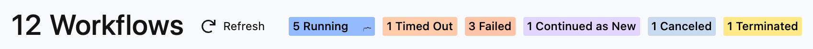

Beside it sits Temporal's own funnel , which filters *to* the value.
**Ctrl/Cmd-click either button** and its clause is added to the current filter instead
of replacing it — here a `CustomerId` filter narrowed to one of its workflows:

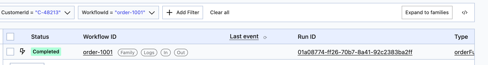

**6. Expand to families.** A filter on a search attribute matches roots, because the
children were never given the attribute. The button in the filter bar adds their families
to the filter:

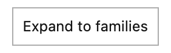

Before — the filter alone:

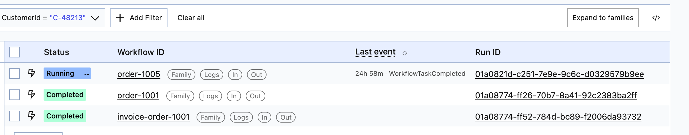

After — one click on the button:

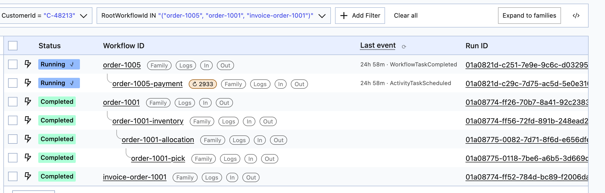

**7. Family focus.** The "Family"  link on any row is a real `<a href>` to every
workflow sharing its root — from a grandchild, the whole family:

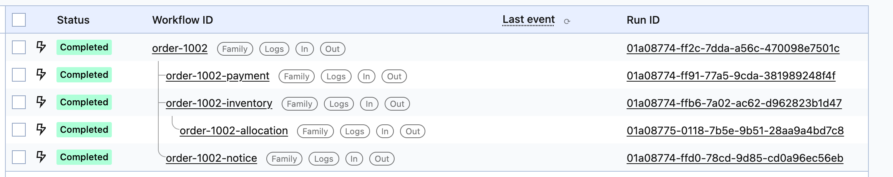

**8. The popup.** One checkbox per feature, all on:

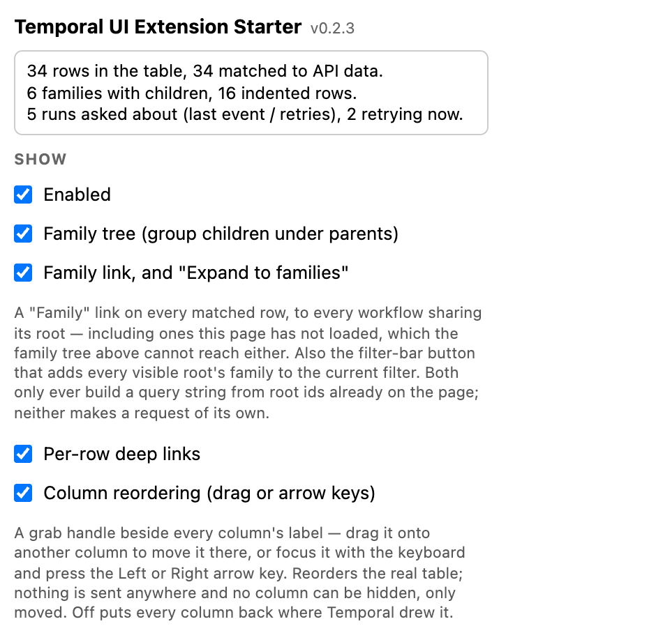

## Read these files in order

Nothing here changes "what can this thing send" — that question is still answered by
the same four files 03's README lists, unchanged. What changed is "what does this show,
and who decides the order of it." Each file's header states its own rules.

| # | Feature | File | The question it answers |
|---|---|---|---|
| 1 | JSON viewer | [`src/payloads/jsonViewer.ts`](src/payloads/jsonViewer.ts) | How a value reaches the screen without ever passing through `JSON.parse`/`JSON.stringify` — the two functions that round a 20-digit id. |
| 2 | Column reordering | [`src/list/columnReorder.ts`](src/list/columnReorder.ts) | Who is allowed to move a `<th>`/`<td>` — the single layout owner for column position, and why it has to run **after** `applyToTable` (see [`docs/design-notes.md`](../docs/design-notes.md#two-owners-for-one-columns-position)). |
| 3 | Page size | [`src/list/pageSize.ts`](src/list/pageSize.ts) | Why `1000`, why its label carries a `*` and its value does not, and how the option is found on a `<select>` with no fixed id. |
| 4 | Expand to families / family focus | [`src/family/expandButton.ts`](src/family/expandButton.ts), [`src/family/familyRender.ts`](src/family/familyRender.ts) | What a click does with the roots already on this page, and why the focus link is a real `<a href>` rather than a click handler. |
| 5 | Column copy | [`src/list/columnCopy.ts`](src/list/columnCopy.ts) | Why a column's values are read out of the live table at click time, never captured when the button was drawn. |
| 6 | NOT filter / additive filtering | [`src/list/filters.ts`](src/list/filters.ts) | Why there is exactly one relocatable `≠` button instead of one per row, at a page size that can now be 1,000. |

Why no JSON-viewer package fits — every one on npm takes an already-parsed value, the
wrong shape for a payload that must not round-trip through a double — is in
[`docs/design-notes.md`](../docs/design-notes.md#every-json-viewer-wanted-a-parsed-value).

### What changed in files 03 already had

`src/list/`, most of `src/family/` and `src/payloads/jsonViewer.ts` are new; the rest of
this stage is 03's, with these files changed:

- **`src/payloads/payloadButton.ts` and `src/payloads/tooltip.ts`** — 03 draws one `{ }`
  button that fetches both the input and the result on every hover. 04 splits it into
  two independent buttons, **In** and **Out**, each costing its own request. Both share
  one panel — one generation counter, one hover/close timer pair — so a stale answer for
  the kind the panel used to show cannot paint over a newer one.
- **`src/rowInfo/rowInfoRender.ts`** — the "Last event" column stamps a
  `data-tuis-column` marker so `src/list/columns.ts` can name it without reading its
  label (which also holds the refresh button).
- **`src/types.ts` and `src/family/rows.ts`** — add `rootExecution` (a newer server's own
  answer, proto field 18) and an always-populated `rootWorkflowId`, which
  `resolveLocalRoots()` falls back to the same page-local parent walk 01's `buildTree()`
  does. "Expand to families" needs a stable grouping key over rows a filter matched.
- **`src/detail/detail.ts`** — a single workflow's own page has no list response to read
  a root from and no siblings to walk, so `rootWorkflowId` falls back to the workflow's
  own id.

## Security card

| | 04 — UI goodies |
|---|---|
| **Permissions requested** | `storage`, and nothing else — **the same permission surface as 03** |
| **Host permissions** | none |
| **Runs on** | `https://cloud.temporal.io/*`, `http://localhost/*`, `http://127.0.0.1/*` |
| **Service worker** | none |
| **Data it reads** | everything 03 reads — nothing here reads a new kind of data; it renders, reorders or copies data this page already had a route to |
| **Data it writes** | `chrome.storage.sync` — the same toggles and templates 03 wrote, plus this stage's own settings: `columnOrder`, `columnReorderEnabled`, `familyEnabled`, `notFilterEnabled`. No cookies, no `localStorage`, no files |
| **Requests it makes** | the same as 03: up to two per *running* row for the `Last event` column and retry badge, plus one history event per payload question (now askable independently per direction), plus the codec POST only when you have named a server. Column reordering, the page-size option, expand-to-families, family focus, column copy and the NOT filter make **no request of their own** |
| **Data that leaves the machine** | over the network, the same as 03: only the *undecodable* payloads of a row you hover, and only once you have named a codec server. Off the network, two new clipboard paths exist, and one of them can carry a decoded payload — see below |
| **Payloads it decodes** | the same as 03. This stage changes how a decoded value is *drawn*, never how it is decoded |
| **Credentials it holds** | none — unchanged from 03 |
| **Whose data it will fetch** | the same ledger as 03: only the runs this page itself listed |
| **Third-party code in the bundle** | 03's set, plus `jsonc-parser` for the JSON viewer's lexer — see [Dependencies](#dependencies) |

### Two new paths: the clipboard

Two buttons write to the clipboard — a channel no earlier stage uses — and they carry
different risk.

**The column-header button** (`src/list/columnCopy.ts`) copies visible table text:
whatever the header names, read out of the live `<td>` at the moment of the click — a
workflow id, a status, a start time. Never a decoded payload: no column of decoded
payload text exists on this table.

**The payload-panel button** (`copyBodyText()` in `src/payloads/tooltip.ts`) copies
whatever the panel is showing right now: `Loading…`, `Still running.`, an error, or the
decoded payload itself, exactly as drawn, In or Out included. This is the more sensitive
of the two: a click here can put an entire decoded value, whatever fields the workflow's
own author put in it, onto the system clipboard.

Three things bound both buttons the same way:

- **Gated on a click.** There is no path from a render pass to the clipboard; each
  button only ever fires `navigator.clipboard.writeText()` from its own `click` handler.
- **Reads only what is already rendered on screen** at the moment of the click — never
  a re-fetch and never a re-decode.
- **No new decode, no new destination.** Both buttons copy a value this extension
  already had on the page, and the clipboard is the only place either one writes — no
  network request, no `chrome.storage`, no file.

## Dependencies

| Package | Version | What it is for |
|---|---|---|
| `jsonc-parser` | 3.3.1 (MIT) | The JSON viewer's **lexer**, not a parser: it is used only to find where each token starts and ends in the original text. What a token *means* to a reader is decided from a raw substring of that text, never from the scanner's own decoded value. The survey that ruled out every JSON-viewer package on npm is in [`docs/design-notes.md`](../docs/design-notes.md#every-json-viewer-wanted-a-parsed-value). |
| `valibot` | 1.4.2 (MIT) | The same runtime schema validation 02 and 03 use at every `postMessage` boundary |
| `p-limit` | 7.3.2 (MIT) | The same four-in-flight ceiling on requests to Temporal's API |
| `yocto-queue` | 1.2.2 (MIT) | `p-limit`'s queue — nothing of ours imports it |

The policy behind the choices is in the [root README](../README.md#dependencies).

## Layout

`src/` is grouped by lesson: its root holds the bundle entry points and the modules
every lesson touches, and each directory below is one thing the extension does.
`src/list/` is new here; the rest is 03's, with the changed files listed
[above](#what-changed-in-files-03-already-had).

```
src/
  inject.ts         MAIN world — wraps window.fetch, posts the list rows it sees
  apiInject.ts      MAIN world — every message accepted from the page (byte-identical to 03)
  content.ts        ISOLATED world — wiring, and nothing else
  popup.ts          the toolbar popup, including every toggle this stage adds
  render.ts         the table, the row identity, the family order, the master switch
  decoration.ts     every root class the writers use, and the list the switch sweeps
  settings.ts       chrome.storage.sync — including this stage's own settings
  types.ts          the shapes crossing the postMessage boundary
  page/             the boundary with the page's own Temporal API — unchanged from 03
  family/           the tree (01, unchanged), root resolution, family focus, expand
  rowInfo/          the two columns that cost a request
  links/            URL templates, and the anchors they become
  detail/           one workflow's own page — folds its responses, fetches nothing
  payloads/         the panel, the codec request, and the new lossless JSON viewer
    jsonViewer.ts   pure: a lossless, bounded, coloured render of a JSON payload
    payloadButton.ts  the In/Out buttons, carrying no row identity
    tooltip.ts      ISOLATED world — one shared panel, two independent kinds
    (payloads.ts, codec.ts, payloadClient.ts, payloadServe.ts — 03's, unchanged in role)
  list/             this stage — everything about the workflow-list table itself
    columns.ts      pure: reads a header row into typed columns, native vs. extension
    columnReorder.ts  the single layout owner for column position — drag + keyboard
    columnCopy.ts   the copy button on every data-column header
    pageSize.ts     the 1000* option on Temporal's own page-size <select>
    filters.ts      the NOT button, and Ctrl/Cmd-click additive filtering
    query.ts        pure: building and reading the list page's own query string
public/
  manifest.json     one permission: storage — the same as 03
  popup.html        the settings pane (no inline script — MV3 forbids it)
  content.css       connectors, buttons, columns, badges, link bar, panel
  icons/            generated from arithmetic, not a committed image
tests/              the ordering rules, the DOM bugs that cost the most, the request
                    gate, and every egress claim — from the attacker's side
```

## What it deliberately does not do

No download and no export, anywhere — the two Copy buttons
([above](#two-new-paths-the-clipboard)) are the only new way anything leaves the page,
and both stop at the system clipboard. No copy-per-value inside the JSON viewer: the
payload-panel button copies the whole body as currently rendered. No search or filtering
inside payloads. No write to Temporal, anywhere in any project here. No column can be
hidden, only moved — turning column reordering off puts every column back exactly where
Temporal drew it, the same on/off contract `treeEnabled` has for row order.

## Commands

| Command | What it does |
|---|---|
| `npm run build` | Bundle `src/` into `dist/`, copy `public/` over it |
| `npm run watch` | Rebuild on change (does **not** re-copy `public/`) |
| `npm test` | Unit + jsdom specs |
| `npm run typecheck` | `tsc --noEmit` over `src/` and `tests/` |
