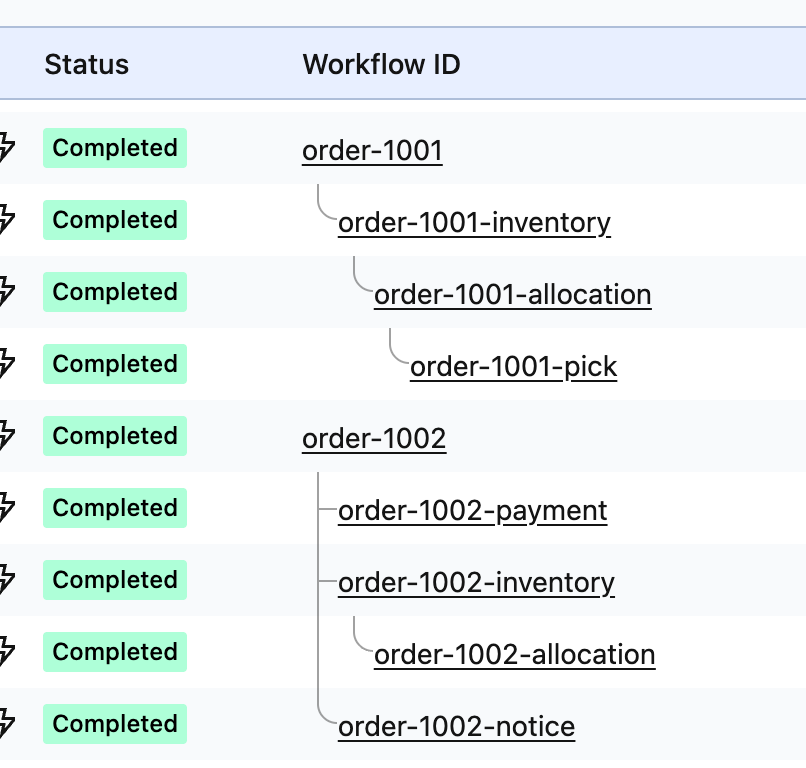
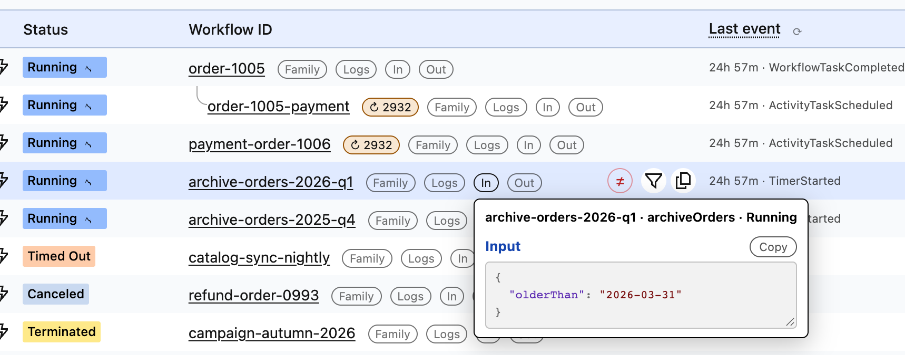
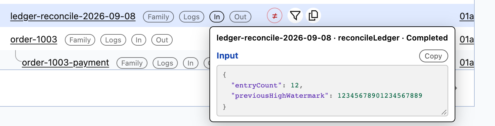

# Temporal UI extension starter

## TL;DR

**A four-stage walkthrough of adding your own view to the Temporal Web UI**, as four
small Chrome extensions. Each one is buildable and loadable on its own; each rung adds
features, and says what it costs. No backend, no credentials, no changes to Temporal —
they work on Temporal Cloud and on a local `temporal server start-dev` because they read
the API responses the page is already fetching.

Stage 01 does one thing: it groups parent/child families under their roots in the
workflow list and draws them — from an extension that asks for **no permissions at all**.



Stage 04 is the same list with everything the four stages add: the tree, a Last event
column, a retrying-activity badge carrying its attempt count, a deep link to your own log
tool per row, and each workflow's input or result on hover, decoded.



## The four stages

1. **01 — family tree.** Parent/child families grouped and drawn in the workflow list.
   No permissions, no requests.
2. **02 — techniques.** Deep links to your own tools (per row, and per activity on a
   workflow's own page), a settings pane, a "last event" column and a retrying-activity
   badge. `storage`; up to two requests per running row, to the page's own API.
3. **03 — payloads.** Each workflow's input and result on hover, decoded in the browser
   or through a codec server you name. The same manifest as 02.
4. **04 — UI goodies.** A lossless JSON viewer, column reordering, a page size of 1,000,
   expand-to-families, family focus, a copy button per column, NOT filtering. The same
   manifest as 03.

## Start with 01

[**`01-family-tree/`**](01-family-tree/) is the whole idea in its smallest form, and
**it asks for no permissions at all** — no `permissions` key, no `host_permissions`,
no service worker, no `chrome.*` call anywhere in its source.

```bash
git clone <this repo> && cd temporal-ui-extension-starter
npm install                    # once, at the root: every project shares it
cd 01-family-tree && npm run build
```

**Node `^22.22.2 || ^24.15.0 || >=26.0.0`** (`node --version`).

`chrome://extensions` → **Developer mode** → **Load unpacked** → select
`01-family-tree/dist/`. Open a workflow list and reload the tab.

Each project's icon carries its own number and colour, so two of them loaded at the
same time are distinguishable in the toolbar.

No Temporal to point it at? `temporal server start-dev` from the
[Temporal CLI](https://docs.temporal.io/cli) gives you one on
http://localhost:8233 in a second, and [Temporal Cloud](https://temporal.io/cloud)
works the same — every project here reads the page's own API, so whichever UI you are
looking at is the one it augments.

## The projects

Separate extensions, not one extension with feature flags. Each is buildable on its
own.

| Project | Adds | Permissions | Requests it makes |
|---|---|---|---|
| [`01-family-tree/`](01-family-tree/) | the family tree, and nothing else | **none** | **none** |
| [`02-techniques/`](02-techniques/) | deep links to your own log tool (per row, and per activity on a workflow's own page), a settings pane, a "last event" column with a refresh control, a retrying-activity badge | `storage` | up to two per **running** row, to the page's own Temporal API, paced and cached; the refresh control floored at one round per run per 5s. Nowhere else |
| [`03-payloads/`](03-payloads/) | each workflow's input and result on hover, decoded through your own codec server | `storage` — **the same permission surface as 02** | the above, plus one history event per question — one for a running row, two for a closed one — and, only once you have named one, the codec server you typed into the popup |
| [`04-ui-goodies/`](04-ui-goodies/) | a lossless JSON viewer with separate In/Out buttons, column reordering, a page size up to 1,000, expand-to-families, one-click family focus, a copy button per column, NOT filtering and additive filtering — [the full list](#stage-04--the-conveniences) | `storage` — **the same permission surface as 03** | the same as 03, nothing new |

The "requests" column is the one cost the manifest does **not** show. 02 declares no
`host_permissions` and still makes requests — from the page's own world, where a host
permission would change nothing (Chrome treats a content-script fetch as cross-origin
even with one).

**02 never decodes a payload.** Everything it shows comes from event metadata — event
types, ids, timestamps, attempt counts, activity type names — so there is no codec
server and no way for a workflow's input, result or failure message to reach the screen
or the wire. 03 is where payloads arrive, and with them the first outbound host and a
panel that can hold somebody's personal data — on a manifest identical to 02's apart
from name, description, version and a tooltip. That is the point of the ladder: **a
permission diff is not a capability diff.**

### Stage 04 — the conveniences

- **Separate In and Out payload buttons** — one per direction, each costing its own
  request — and a Copy button on the panel that copies what it is showing, decoded
  payload included. `src/payloads/payloadButton.ts`, `src/payloads/tooltip.ts`.
- **A lossless JSON viewer**: one colour per token type, indented, always fully drawn,
  and every leaf taken from a raw substring of the original text so a 20-digit id
  survives. Why no JSON-viewer package fits — they all take a *parsed* value, which is
  the wrong shape for an id that must not round-trip through a double — is in
  [`docs/design-notes.md`](docs/design-notes.md#every-json-viewer-wanted-a-parsed-value).
  `src/payloads/jsonViewer.ts`.
- **Column reordering** — a drag handle on every header, keyboard support on the same
  handle, and a toggle that restores Temporal's own order. `src/list/columnReorder.ts`.
- **Workflow-list page size up to 1,000** — Temporal's own per-call ceiling.
  `src/list/pageSize.ts`.
- **Expand to families** — a filter-bar button that pulls in the relatives of the rows
  a filter matched. `src/family/expandButton.ts`.
- **One-click family focus** — a "Family" link on every matched row, to every workflow
  sharing its root, including ones this page never loaded. `src/family/familyRender.ts`.
- **A copy button on each data-column header**, reading the column live at click time.
  `src/list/columnCopy.ts`.
- **NOT filtering** — the negation Temporal's own filter bar does not offer — plus
  Ctrl/Cmd-click additive filtering, for Temporal's own filters and for this one.
  `src/list/filters.ts`.

The viewer, on an input holding `12345678901234567889` unquoted — every digit drawn from
the original text, where the same text through `JSON.parse` reads `12345678901234567000`:



None of it needs a new permission or a new destination: `storage`, and the requests
03 already makes.

## How it works

> The page already fetched the data. Read *that*, instead of asking for it again.

A `document_start` content script in the page's **own** world (`"world": "MAIN"`)
wraps `window.fetch`, clones any response from `/api/v1/namespaces/{ns}/workflows`,
and `postMessage`s the rows to the extension's world, which folds them into a tree and
rewrites the table. Consequently:

- **no `host_permissions`** — 01 never issues a request, and 02's and 03's requests
  are made in the page's world, where a host grant changes nothing;
- **it cannot surface data the user could not already see**, because the only data it
  has is a response the page was allowed to receive — including 03's payloads: the
  same session, the same runs, the same API;
- **Cloud and self-hosted work identically**, since both drive the same API from the
  browser.

Three more properties hold for **01 only**; the ladder shows where each one stops:

| | 01 | 02 | 03 |
|---|---|---|---|
| Holds no credential | yes | it **reads** the page's `Authorization` header in the page's world to re-issue the page's own call. Never stored, never posted to the extension's world, never sent anywhere but Temporal's own API | the same — and the codec request carries **no** credential of any kind (`credentials: 'omit'` as a literal, with no option to attach one) |
| Issues no request | yes | up to two per running row: one `history-reverse` page of one event, one `DescribeWorkflowExecution`. Cached, paced, never for a closed workflow | the same, plus one history event per payload question — one for a running row, two for a closed one — and nothing on render. One pacer for the whole extension: four Temporal requests in flight at most |
| Needs no server | yes | yes — it talks only to the server the page is already talking to | **no.** An encrypted payload needs a codec server you name, and that field is the only thing in the repository that sends a request body to a host of your choosing. Empty by default; empty means 03 sends nothing 02 would not |
| Takes no instruction from the page | yes — the page's world only ever *tells* it things | it **serves** requests over `postMessage`, which is a trust boundary. See [`02-techniques/README.md`](02-techniques/README.md#the-weakness-and-what-closing-most-of-it-took) | the same bus, now carrying decoded payloads back and a caller-named codec host out. See [`03-payloads/README.md`](03-payloads/README.md#the-weakness-and-what-closing-most-of-it-took) |

The full walkthrough — the `window.fetch` getter lock, `<tr>` recycling, the
self-feeding `MutationObserver`, why `z-index` must be exactly `0` — is in
[`docs/how-it-works.md`](docs/how-it-works.md).

## Security

Each project's README carries a **security card** in a fixed shape — permissions,
hosts, what it reads, what it writes, what it requests, what leaves the machine, and
what third-party code is in the bundle — so the projects can be compared line by line.

### Every feature ships on, except one

Every toggle in every project defaults to **on**, and the cost of each one is bounded
and tested: the per-row questions ask only about *running* rows, and the payload panel
asks nothing until a pointer lands on a row.

**One setting defaults to off, and it is the one that names a host.** 03's codec
endpoint is empty out of the box, and that field is the only place an endpoint can
come from — which is what makes "no payload byte leaves this machine" checkable rather
than promised. The rule: default on, unless the setting enables egress, bypasses a
security control, or writes something.

## Dependencies

> **Browser APIs and code in this repository for anything specific to this
> extension** — the trust boundaries, the authorization decisions, what is allowed
> to leave the machine. **Mature, maintained libraries for generic algorithms,**
> where using one makes the example easier to read and harder to get wrong.

A dependency diff is not a manifest permission diff — a package cannot grant itself a
permission — but it is an audit-surface diff: a package runs inside the extension's own
origin with the extension's own privileges.

| | Enters the bundles | Arrives behind another package |
|---|---|---|
| [01](01-family-tree/README.md#dependencies) | `valibot` | — |
| [02](02-techniques/README.md#dependencies) | `valibot`, `p-limit` | `yocto-queue` |
| [03](03-payloads/README.md#dependencies) | `valibot`, `p-limit` — the same set as 02 | `yocto-queue` |
| [04](04-ui-goodies/README.md#dependencies) | `valibot`, `p-limit`, plus `jsonc-parser` for the JSON viewer | `yocto-queue` |

Each project's README names the version, what the package is for, and what stays
application-owned; [`docs/design-notes.md`](docs/design-notes.md#dependencies) records
the alternatives that were measured.

What is and is not checked:

- **The tables are hand-written.** Nothing checks them against the bundles. One rule
  is worth keeping by hand: every third-party package entering a bundle through a
  project's own source is declared in *that* project's `dependencies` — the projects
  share one hoisted install, so a package a sibling declares would otherwise resolve
  silently.
- **This is an audit, not an attestation.** Nothing verifies a package's contents
  against its repository or pins beyond the lockfile's integrity hashes, and a
  transitive package appears in the lockfile diff and nowhere else.
- **Nothing is minified.** Every bundle ships readable with a source map, so what a
  package contributes can be read in `dist/`.

## Layout

```
01-family-tree/     the tree, no permissions               ← start here
02-techniques/      + deep links, settings, two questions  (storage)
03-payloads/        + input and result on hover, a codec server  (storage — the
                    same permission surface as 02, and the first rung that POSTs)
04-ui-goodies/      + JSON viewer, column reordering, page size, expand-to-
                    families, family focus, per-column copy, NOT/additive
                    filtering  (storage — the same permission surface as 03)
docs/how-it-works.md   the mechanism, and its traps
```

Inside each project:

```
src/                the extension, with the reasoning for it in comments
public/             manifest, CSS, generated icons
tests/              unit + jsdom specs, including the idempotency property
```

## Commands

`npm install` once at the root installs every project's dependencies. Then, from a
project directory:

| Command | What it does |
|---|---|
| `npm run build` | Bundle `src/` into `dist/`, copy `public/` over it |
| `npm run watch` | Rebuild on change (does **not** re-copy `public/`) |
| `npm test` | Unit + jsdom specs |
| `npm run typecheck` | `tsc --noEmit` over `src/` and `tests/` |

## Status

- **A UI you do not own can move under you.** Everything here reads Temporal's own
  markup and URLs. Where a selector is load-bearing, the file says so and the failure
  is visible rather than silent — the deep-link bar parks itself in the corner and the
  popup reports it.
- **Not covered**: a self-hosted UI holding real workflows, and the rate-limit backoff
  against a real Temporal rate limiter.
- A self-hosted UI on another hostname needs that hostname added to the project's
  `public/manifest.json`.

## Licence and affiliation

MIT — see [`LICENSE`](LICENSE).

This is a community sample. It is **not affiliated with, endorsed by, or supported by
Temporal Technologies**, and it uses no Temporal branding. "Temporal" is used only to
say which product it works with.
